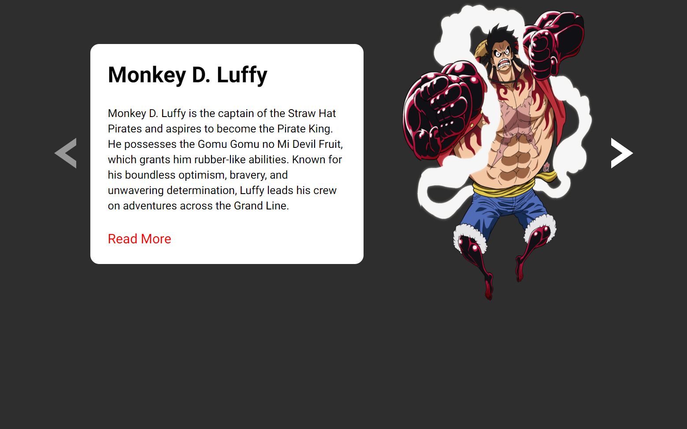

# Projeto de Carrossel

## Visão Geral

Este projeto é um carrossel simples e dinâmico construído usando HTML, CSS e JavaScript. O carrossel exibe múltiplos itens, permitindo que os usuários naveguem entre eles usando botões de navegação anteriores e próximos. O projeto apresenta design responsivo para garantir a usabilidade em diferentes tamanhos de tela.

## Funcionalidades

- **Design Responsivo:** Ajusta o layout para telas móveis e desktops.
- **Animação:** Transições suaves entre os itens do carrossel.
- **Navegação:** Botões de navegação anteriores e próximos para navegar pelos itens do carrossel.
- **Navegação Desativada:** Desativa automaticamente os botões de navegação quando está no início ou no final do carrossel.
- **Exibição de Conteúdo:** Cada item do carrossel inclui uma imagem e um texto descritivo.

## Tecnologias Utilizadas

- HTML
- CSS
- JavaScript

## Preview

### Desktop

### Mobile

### [Preview Project](https://guilherme-dev15.github.io/Projeto-de-Carrossel-JS/)